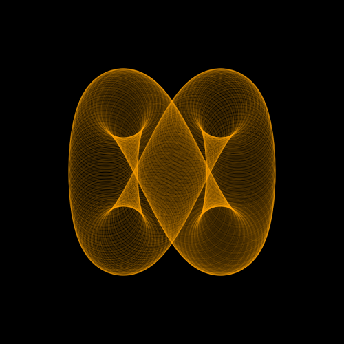
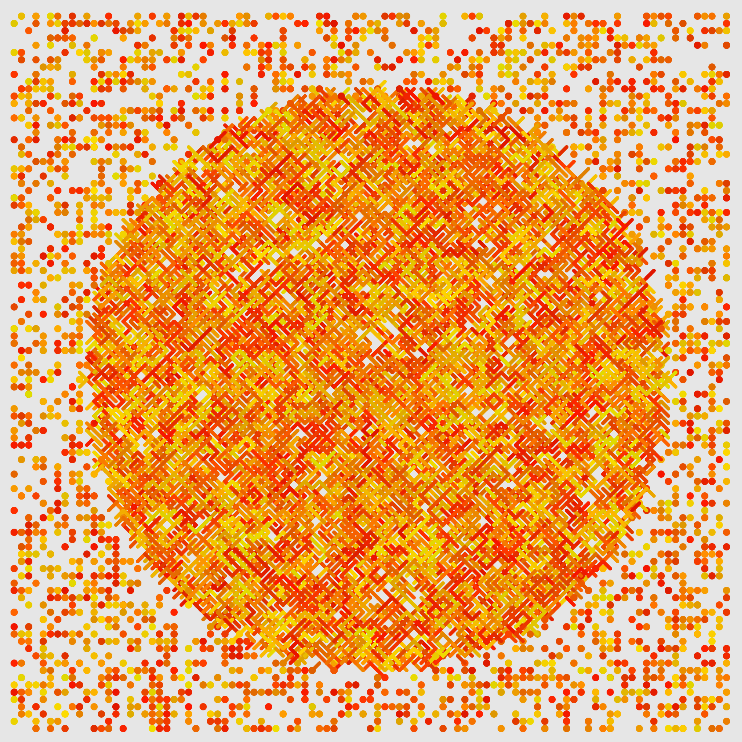

# generativeart

[](https://github.com/jdxyw/generativeart/actions/workflows/go.yml)
[](https://goreportcard.com/report/github.com/jdxyw/generativeart)
[](https://raw.githubusercontent.com/jdxyw/generativeart/master/LICENSE)


`generativeart` is a `Go` package to generate many kinds of generative art. The goal is to collect some excellent generative art (implemented in `R` or `Processing`), and rewrite them in `Go` again. I would paste the original link at the end of this README(If I remember. You can also submit a PR if you found I miss something.). Currently, it supports the following type.

This package is still working in progress, more types would be added. Welcome anyone interested in this field to submit your PR.

- Maze
- Julia Set
- Random Circle Trails
- Silk Smoke
- Spiral Square
- Square Grid
- Circle Line
- Circle Loop
- Silk Sky
- Dot Line
- Swirl
- Point Ribbon
- Janus
- Random Shapes
- Color Circle
- Color Circle2
- Circle Grid

For these kinds of art, the package provides as many as parameters to control the appearance.

## Install

The go version I used is `Go 1.16`.

```bash
go get github.com/jdxyw/generativeart
```

## Art Type

```go
NewCircleLine(step float64, lineNum int, radius, xaixs, yaixs float64)
NewCircleLoop(radius float64)
NewMaze(step int)
NewRandCicle(mc, msp int, minStep, maxStep, minr, maxr float64, isRandColor bool)
NewSilkSky(circleNum int, sunRadius float64)
NewSilkSmoke(mc, msp int, minStep, maxStep, minRadius, maxRadius float64, isRandColor bool)
NewSpiralSquare(squareNum int, rectSide, decay float64, randColor bool)
NewSwirl(a, b, c, d, xaixs, yaixs float64)
NewDotLine(n int, ras, canv float64, randColor bool)
NewPointRibbon(r float64)
NewJanus(n int, decay float64)
NewRandomShape(shapeNum int)
NewColorCircle(circleNum int)
NewColorCircle2(circleNum int)
NewCircleGrid(circleNumMin, circleNumMax int)
```

## Docs

You could find the docs in the [doc](./docs).

## Examples

You could find examples for all types under [example](./example).
## General Options

```go
type Options struct {
	background  color.RGBA
	foreground  color.RGBA
	lineColor   color.RGBA
	lineWidth   float64
	colorSchema []color.RGBA
	nIters      int
	alpha       int
}
```

The `Options` is a global option for the whole `canva`. It includes those general parameters used by different kinds of types, such as `background`, `lineColor`, and `colorScheme`.

For those parameters specified for different kinds of art types, they have their own `struct`.
## Usage and example

### Junas

```go
func main() {
	rand.Seed(time.Now().Unix())
	c := generativeart.NewCanva(500, 500)
	c.SetBackground(generativeart.Black)
	c.FillBackground()
	c.SetColorSchema(generativeart.DarkRed)
	c.SetForeground(generativeart.LightPink)
	c.Draw(generativeart.NewJanus(10, 0.2))
	c.ToPNG("janus.png")
}
```


### Random Shapes

```go
func main() {
	rand.Seed(time.Now().Unix())
	c := generativeart.NewCanva(500, 500)
	c.SetBackground(generativeart.White)
	c.FillBackground()
	c.SetColorSchema([]color.RGBA{
		{0xCF, 0x2B, 0x34, 0xFF},
		{0xF0, 0x8F, 0x46, 0xFF},
		{0xF0, 0xC1, 0x29, 0xFF},
		{0x19, 0x6E, 0x94, 0xFF},
		{0x35, 0x3A, 0x57, 0xFF},
	})
	c.Draw(generativeart.NewRandomShape(150))
	c.ToPNG("randomshape.png")
}
```


### Color Circle2

```go
func main() {
	rand.Seed(time.Now().Unix())
	colors := []color.RGBA{
		{0x11, 0x60, 0xC6, 0xFF},
		{0xFD, 0xD9, 0x00, 0xFF},
		{0xF5, 0xB4, 0xF8, 0xFF},
		{0xEF, 0x13, 0x55, 0xFF},
		{0xF4, 0x9F, 0x0A, 0xFF},
	}
	c := generativeart.NewCanva(800, 800)
	c.SetBackground(generativeart.White)
	c.FillBackground()
	c.SetColorSchema(colors)
	c.Draw(generativeart.NewColorCircle2(30))
	c.ToPNG("colorcircle2.png")
}
```


### Circle Grid

```go
func main() {
	rand.Seed(time.Now().Unix())
	colors := []color.RGBA{
		{0xED, 0x34, 0x41, 0xFF},
		{0xFF, 0xD6, 0x30, 0xFF},
		{0x32, 0x9F, 0xE3, 0xFF},
		{0x15, 0x42, 0x96, 0xFF},
		{0x00, 0x00, 0x00, 0xFF},
		{0xFF, 0xFF, 0xFF, 0xFF},
	}
	c := generativeart.NewCanva(500, 500)
	c.SetBackground(color.RGBA{0xDF, 0xEB, 0xF5, 0xFF})
	c.FillBackground()
	c.SetColorSchema(colors)
	c.SetLineWidth(2.0)
	c.Draw(generativeart.NewCircleGrid(4, 6))
	c.ToPNG("circlegrid.png")
}
```


### Silk Smoke

```go
func main() {
	rand.Seed(time.Now().Unix())
	c := generativeart.NewCanva(500, 500)
	c.SetBackground(generativeart.Black)
	c.SetLineWidth(1.0)
	c.SetLineColor(generativeart.MediumAquamarine)
	c.SetAlpha(30)
	c.SetColorSchema(generativeart.Plasma)
	c.SetIterations(4)
	c.FillBackground()
	c.Draw(generativeart.NewSilkSmoke(400, 20, 0.2, 2, 10, 30, false))
	c.ToPNG("silksmoke.png")
}
```


### Spiral Square

```go
func main() {
	rand.Seed(time.Now().Unix())
	c := generativeart.NewCanva(500, 500)
	c.SetBackground(generativeart.MistyRose)
	c.SetLineWidth(10)
	c.SetLineColor(generativeart.Orange)
	c.SetColorSchema(generativeart.Plasma)
	c.SetForeground(generativeart.Tomato)
	c.FillBackground()
	c.Draw(generativeart.NewSpiralSquare(40, 400, 0.05, true))
	c.ToPNG("spiralsquare.png")
}
```


### Circle Loop

```go
func main() {
	rand.Seed(time.Now().Unix())
	c := generativeart.NewCanva(500, 500)
	c.SetBackground(generativeart.Black)
	c.SetLineWidth(1)
	c.SetLineColor(generativeart.Orange)
	c.SetAlpha(30)
	c.SetIterations(1000)
	c.FillBackground()
	c.Draw(generativeart.NewCircleLoop(100))
	c.ToPNG("circleloop.png")
}
```



### Dot Line

```go
func main() {
	rand.Seed(time.Now().Unix())
	c := generativeart.NewCanva(2080, 2080)
	c.SetBackground(color.RGBA{230, 230, 230, 255})
	c.SetLineWidth(10)
	c.SetIterations(4000)
	c.SetColorSchema(generativeart.Plasma)
	c.FillBackground()
	c.Draw(generativeart.NewDotLine(100, 20, 50, false))
	c.ToPNG("dotline.png")
}
```



### Julia Set

```go
func julia1(z complex128) complex128 {
	c := complex(-0.1, 0.651)
	z = z*z + c

	return z
}

func main() {
	rand.Seed(time.Now().Unix())
	c := generativeart.NewCanva(500, 500)
	c.SetIterations(800)
	c.SetColorSchema(generativeart.Viridis)
	c.FillBackground()
	c.Draw(generativeart.NewJulia(julia1, 40, 1.5, 1.5))
	c.ToPNG("julia.png")
}
```


### Silk Sky

```go
func main() {
	rand.Seed(time.Now().Unix())
	c := generativeart.NewCanva(600, 600)
	c.SetAlpha(10)
	c.Draw(generativeart.NewSilkSky(15, 5))
	c.ToPNG("silksky.png")
}
```


### Maze

```go
func main() {
	rand.Seed(time.Now().Unix())
	c := generativeart.NewCanva(600, 600)
	c.SetBackground(generativeart.Azure)
	c.SetLineWidth(3)
	c.SetLineColor(generativeart.Orange)
	c.FillBackground()
	c.Draw(generativeart.NewMaze(20))
	c.ToPNG("maze.png")
}
```


### Random Circle

```go
func main() {
	rand.Seed(time.Now().Unix())
	c := generativeart.NewCanva(500, 500)
	c.SetBackground(generativeart.MistyRose)
	c.SetLineWidth(1.0)
	c.SetLineColor(color.RGBA{
		R: 122,
		G: 122,
		B: 122,
		A: 30,
	})
	c.SetColorSchema(generativeart.Plasma)
	c.SetIterations(4)
	c.FillBackground()
	c.Draw(generativeart.NewRandCicle(30, 80, 0.2, 2, 10, 30, true))
	c.ToPNG("randcircle.png")
}
```


## TODO

- Add more kinds of generative arts or types.

## Contribution

Thanks for the following sites and repos, I got lots of ideas, inspiration, code and tricks from them. The list would be very long, sorry for forgetting some of them.

- https://inconvergent.net/
- https://fronkonstin.com/
- https://github.com/aschinchon/cyclic-cellular-automata
- https://github.com/armdz/ProcessingSketchs
- https://github.com/Mr-Slesser/Generative-Art-And-Fractals
- https://github.com/cdr6934/Generative-Processing-Experiments
- https://github.com/pkd2512/inktober2017
- http://blog.dragonlab.de/2015/03/generative-art-week-1
- https://editor.p5js.org/kenekk1/sketches/Ly-5XYvKX
- http://paulbourke.net/fractals/peterdejong/
- https://editor.p5js.org/kenekk1/sketches/O44Dln5oo
- https://openprocessing.org/sketch/1071233
- https://twitter.com/okazz_
